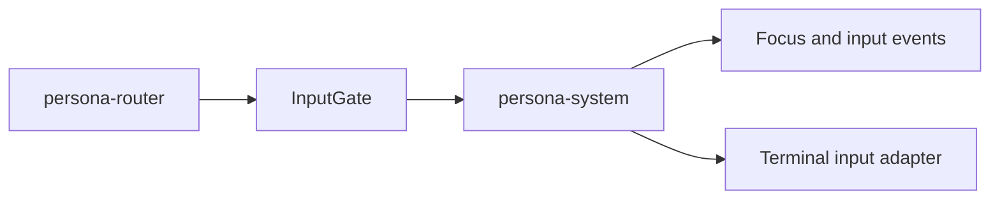

# Persona System Architecture

`persona-system` is the OS/window-manager abstraction layer for Persona.

The crate should stay small. It names what Persona needs from an operating
system without forcing every downstream component to know about Niri, Wayland,
or a future macOS adapter.
